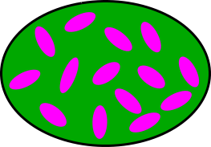

---
format:
  html:
    code-links:
      - text: Python script
        icon: file-code
        href: viscoelasticity_time.py
---

# Time-domain viscoelastic homogenization {#sec-viscoelasticity-time}

::: {.callout-important icon=false}

##  Objectives

This chapter presents the time-domain approach to homogenization of ageing linear viscoelastic composites, following [@sanahuja2013; @barthelemyIJSS2016; @barthelemyIJES2019]. It covers:

- The **Volterra operator formalism** for ageing linear viscoelasticity and why ageing materials require a direct time-domain treatment,
- The **numerical discretization** of Volterra integrals via trapezoidal block matrices [@sanahuja2013],
- The **ALV Hill (polarization) tensor kernel** [@barthelemyIJSS2016] and its block property (see also @sec-hill_alv),
- **Homogenization schemes** (Maxwell, DIL, MT, SC) for ellipsoidal inclusions in ALV media [@barthelemyIJES2019],
- The *Echoes* commands `visco_law` and `homogenize_visco` for practical computations,
- Validation against the Laplace-Carson approach (@sec-complex-moduli) for a non-ageing PMMA composite,
- Application to an ageing matrix–inclusion composite with a Kelvin-chain creep law [@barthelemyIJES2019].

:::

::: {.callout-tip icon=false collapse=true}

##  Imports

```{python}
#| code-fold: false
#| code-summary: Code for library imports

from numpy import *
import matplotlib.pyplot as plt
from echoes import *
from mpmath import mp
import sys
sys.path.insert(0, 'mittag_leffler')
from mittag_leffler import ml as mittag_leffler, I_Rabotnov

mp.dps = 25
set_printoptions(precision=6, suppress=True)
```

The Mittag-Leffler function is provided by the [`mittag-leffler`](https://github.com/khinsen/mittag-leffler) package [@hinsen2025], placed in the `mittag_leffler/` subfolder alongside this chapter.

:::

## Volterra operator formalism {#sec-volterra-operator}

### Hereditary law and Volterra operator

A **linear causal** material stores the full history of loading. Under uniaxial stress, the strain at time $t$ due to an infinitesimal stress increment $\ud\sigma(t')$ applied at past time $t' \le t$ equals $J(t,t')\,\ud\sigma(t')$. Integrating over all past increments (Stieltjes integral) gives the **hereditary law**:

$$
\varepsilon(t) = \int_{-\infty}^{t} J(t,t')\,\ud\sigma(t')
$$

The compact notation $\varepsilon = J \circ \sigma$ defines the **Volterra operator** associated with the kernel $J(t,t')$. For 4th-order tensor kernels, the contraction over the tensor indices gives the **tensor Volterra double contraction**:

$$
\boldsymbol{\varepsilon}(t) = \uuuu{J}(t,\bullet) \dcirc \boldsymbol{\sigma}(\bullet)
\quad\Longleftrightarrow\quad
\varepsilon_{ij}(t) = \int_{-\infty}^{t} J_{ijkl}(t,t')\,\ud\sigma_{kl}(t')
$$ {#eq-volterra-creep}

The dual **relaxation** form writes $\boldsymbol{\sigma} = \uuuu{C} \dcirc \boldsymbol{\varepsilon}$, i.e.:

$$
\sigma_{ij}(t) = \int_{-\infty}^{t} C_{ijkl}(t,t')\,\ud\varepsilon_{kl}(t')
$$ {#eq-volterra-relax}

### Product of Volterra kernels and inverse

The **product** of two scalar Volterra kernels $F$ and $G$ is defined by:

$$(F \circ G)(t,t') = \int_{-\infty}^{t} F(t,\tau)\,\frac{\partial G}{\partial \tau}(\tau,t')\,\ud\tau$$

This product is associative and distributive over addition, but **not commutative**. The **identity** for this product is the Heaviside function $H(t,t') = H(t-t')$ (step function). The **Volterra inverse** $\volt{F}$ of a kernel $F$ satisfies:

$$
\volt{F} \circ F = F \circ \volt{F} = H
$$ {#eq-volterra-inverse}

For 4th-order tensor kernels, the tensor Volterra inverse $\volt{\uuuu{C}}$ satisfies $\volt{\uuuu{C}} \dcirc \uuuu{C} = H\,\uuuu{I}$ (where $\uuuu{I}$ is the 4th-order identity tensor), so that $\uuuu{J} = \volt{\uuuu{C}}$ is the creep compliance and $\uuuu{C} = \volt{\uuuu{J}}$ is the relaxation tensor.

### Ageing vs. non-ageing

For a **non-ageing** material, the kernel depends only on the time difference: $\uuuu{C}(t,t') = \uuuu{C}(t-t')$. The Volterra product reduces to a convolution, and the **Laplace-Carson transform** $\tilde{\cal F}(p) = p\int_0^\infty e^{-pt}{\cal F}(t)\,\ud t$ converts the hereditary law into an algebraic relation $\tilde{\boldsymbol{\sigma}}(p) = \tilde{\uuuu{C}}(p):\tilde{\boldsymbol{\varepsilon}}(p)$. The correspondence principle then extends elastic homogenization results directly (see @sec-complex-moduli).

For an **ageing** material, $\uuuu{C}(t,t')$ depends on both $t$ and $t'$ independently. The convolution structure is broken, the Laplace-Carson approach fails, and a direct time-domain treatment is required. This is the focus of the present chapter.

## Numerical discretization {#sec-visco-discretization}

### Block matrix representation of Volterra integrals

Over a discrete time series $t_0 < t_1 < \cdots < t_n$, the Volterra integral is approximated by a finite sum. Define the **block relaxation matrix** of phase $r$ as the lower-triangular block matrix:

$$
\mathbf{R}^r = \bigl([\mathbf{R}^r]_{ij}\bigr)_{0\le j\le i\le n},
\qquad [\mathbf{R}^r]_{ij} = \uuuu{C}^r(t_i,t_j) \in \mathbb{R}^{6\times 6}
$$

The discrete constitutive law $\boldsymbol{\Sigma} = \mathbf{R}^r\,\boldsymbol{E}$ (block matrix–vector product) is an approximation of the Volterra integral @eq-volterra-relax, where $\boldsymbol{\Sigma}$ and $\boldsymbol{E}$ are block vectors of stresses and strains at the discrete times.

### Trapezoidal discretization [@sanahuja2013]

Starting from @eq-volterra-relax with zero initial conditions before $t_0$, integrate by parts and apply the trapezoidal rule on each interval $[t_j, t_{j+1}]$. The result is $\sigma(t_i) = \sum_{k=0}^{i} M_{ik}\,\varepsilon(t_k)$ with:

$$
M_{ik} = \begin{cases}
R(t_0,\,t_0) & i=k=0 \\[4pt]
\dfrac{1}{2}\bigl[R(t_i,t_{i-1}) + R(t_i,t_i)\bigr] & i=k>0 \\[4pt]
\dfrac{1}{2}\bigl[R(t_i,t_0) - R(t_i,t_1)\bigr] & i>0,\;k=0 \\[4pt]
\dfrac{1}{2}\bigl[R(t_i,t_{k-1}) - R(t_i,t_{k+1})\bigr] & i>k>0
\end{cases}
$$ {#eq-visco-mat}

The lower-triangular structure reflects **causality**: $\sigma(t_i)$ depends only on $\varepsilon(t_k)$ for $k \le i$.

### Python implementation

```{python}
#| code-fold: false

def visco_mat(f, t):
    """Lower-triangular discretization matrix for scalar kernel f(t, t').
    Implements Eq. (visco-mat) with zero initial conditions."""
    n = len(t)
    M = zeros((n, n))
    M[0, 0] = f(t[0], t[0])
    for i in range(1, n):
        M[i, 0] = 0.5 * (f(t[i], t[0]) - f(t[i], t[1]))
        M[i, i] = 0.5 * (f(t[i], t[i-1]) + f(t[i], t[i]))
    for i in range(2, n):
        for j in range(1, i):
            M[i, j] = 0.5 * (f(t[i], t[j-1]) - f(t[i], t[j+1]))
    return M
```

For illustration, consider a Maxwell relaxation $R(t,t') = e^{-(t-t')/\tau}$ with $\tau=20$:

```{python}
#| code-fold: false

tau_m = 20.
R_maxwell = lambda t, tp: exp(-(t - tp) / tau_m)
t_small = array([0., 5., 15., 40., 80.])
M = visco_mat(R_maxwell, t_small)
print("Relaxation matrix M (lower triangular):")
print(M)
print("\nCreep matrix M⁻¹:")
print(linalg.inv(M))
```

### The `visco_law` object in *Echoes*

The 6×6 block version of @eq-visco-mat — where each scalar entry becomes a $6\times 6$ tensor block — is built by `visco_law(func, MODE)`:

```{python}
#| code-fold: false

Cs = stiff_Enu(1., 0.2);  ks, mus = Cs.kmu
fk  = lambda t: 0.5 * exp(-t / 20.) + 0.5   # ageing factor
fmu = lambda t: 0.5 * exp(-t / 20.) + 0.5

Js = lambda t, tp: (fk(tp)  / (3*ks)  + 0.1/ks  * log(1. + (t-tp) / 2.)) * J4 \
                 + (fmu(tp) / (2*mus) + 0.1/mus * log(1. + (t-tp) / 1.)) * K4

vl = visco_law(Js, CREEP)
```

The call `vl.mat(t)` returns the block creep matrix of size $6(n+1)\times 6(n+1)$; `vl.relaxation_mat(t)` returns the corresponding block relaxation matrix (Volterra inverse, computed numerically). Let us display the $(1,1)$-component of each block for a 4-step series:

```{python}
#| code-fold: false

t3 = array([0., 5., 15., 40.])
M_block = vl.mat(t3)
print("Creep block matrix — (11)-component of each 6×6 block:")
for i in range(4):
    row = "  ".join(f"{M_block[6*i, 6*j]:8.5f}" for j in range(4))
    print(f"  t={t3[i]:4.0f}:  {row}")
```

The matrix is strictly lower-triangular: $\boldsymbol{\varepsilon}(t_i)$ depends only on past stresses. The diagonal entries $J(t_i,t_i)$ decrease with age $t_i$ (the material stiffens over time).

### Symmetry decomposition: `visco_paramsym` and `visco_tensor` {#sec-visco-sym}

For an isotropic material, the relaxation tensor decomposes as $\uuuu{C}(t,t') = 3k(t,t')\,\uuuu{J} + 2\mu(t,t')\,\uuuu{K}$. At the discrete level the 6$(n+1)$$\times$6$(n+1)$ block matrix inherits this structure: its information is entirely captured by independent scalar $(n+1)\times(n+1)$ **parameter blocks**, one per independent modulus of the material symmetry class.

**`visco_paramsym`** extracts these blocks from a block matrix:

```python
params = visco_paramsym(array, sym, theta=0., phi=0., psi=0., unitsize=6)
# array        : block relaxation/creep matrix, size 6(n+1)×6(n+1)
# sym          : material symmetry — ISO, TI, ORTHO, ANISO
# theta,phi,psi: Euler rotation angles of the symmetry axes (default 0)
# unitsize     : size of each tensor block (default 6)
# returns      : list of (n+1)×(n+1) sub-matrices
#                ISO   → [Vk, Vmu]                   (bulk, shear)
#                TI    → [Vl, Vm, Vn, Vp, Vq]        (5 moduli)
#                ORTHO → [V11,V22,V33,V44,V55,V66,V12,V13,V23]
#                ANISO → 21 components
```

**`visco_tensor`** reconstructs the full block matrix from the parameter blocks (inverse of `visco_paramsym`):

```python
array = visco_tensor(params, angles=[])
# params : list of (n+1)×(n+1) sub-matrices
# angles : rotation angles matching those used in visco_paramsym
# returns: block matrix of size 6(n+1)×6(n+1)
```

Continuing the previous example (`vl`, `t3`):

```{python}
#| code-fold: false

M_relax = vl.relaxation_mat(t3)
Vk, Vmu = visco_paramsym(M_relax, ISO)   # bulk and shear (n+1)×(n+1) blocks

print("Bulk relaxation block Vk  [k(ti, tj)]:")
print(Vk)
print("\nShear relaxation block Vmu  [mu(ti, tj)]:")
print(Vmu)
```

The $(i,j)$ entry of `Vk` (resp. `Vmu`) is the bulk (resp. shear) relaxation modulus $k(t_i,t_j)$ (resp. $\mu(t_i,t_j)$). The lower-triangular structure reflects causality. Reconstruction with `visco_tensor` is exact:

```{python}
#| code-fold: false

M_check = visco_tensor([Vk, Vmu], [])
print("Max reconstruction error:", abs(M_relax - M_check).max())
```

## ALV Eshelby problem and Hill tensor kernel {#sec-ageing-eshelby}

### Problem statement

Consider an ellipsoidal inclusion $\mathcal{E}$ (shape tensor $\uu{A}$) embedded in an infinite ALV matrix with relaxation kernel $\uuuu{C}^0(t,t')$. The inclusion has relaxation kernel $\uuuu{C}^\mathcal{E}(t,t')$. Under remote strain loading $\uu{E}(t)$, the strain and stress fields inside $\mathcal{E}$ remain **uniform** — a key result that extends the Eshelby theorem to ALV [@barthelemyIJSS2016].

### ALV Hill tensor kernel

The strain inside the inclusion due to a uniform eigenstress (polarization) $\uu{p}(t)$ in $\mathcal{E}$ is given by the **ALV Hill tensor kernel** $\uuuu{P}_\mathcal{E}(t,t')$:

$$
\boldsymbol{\varepsilon}_{|\mathcal{E}}(t) = -\uuuu{P}_\mathcal{E}(t,\bullet) \dcirc \uu{p}(\bullet)
$$

The formula for $\uuuu{P}_\mathcal{E}(t,t')$ and its derivation are given in @sec-hill_alv (@eq-alv-hill-kernel). The fundamental result is the **block property** (@eq-block-hill-prop): over a discrete time grid,

$$
\bigl[\mathbf{P}_\mathcal{E}(\mathbf{R}^0)\bigr]_{ij}
= \mathbb{P}_\mathcal{E}\!\bigl([\mathbf{R}^0]_{ij}\bigr)
$$ {#eq-block-hill}

Block $(i,j)$ of the block Hill matrix equals the **elastic Hill tensor** evaluated at the $(i,j)$ block of the reference relaxation matrix. This reduces ALV homogenization to a collection of elastic Hill tensor evaluations.

### Isotropic matrix case

When the matrix is isotropic, $\uuuu{C}^0(t,t') = 3k^0(t,t')\,\mathbb{J} + 2\mu^0(t,t')\,\mathbb{K}$, the ALV Hill tensor kernel decouples (see @sec-hill_alv):

$$
\uuuu{P}_\mathcal{E}(t,t') =
\volt{\!\left(k^0 + \tfrac{4}{3}\mu^0\right)}_{(t,t')}\,\uuuu{U}^{\uu{A}}
+ \volt{\mu^0}_{(t,t')}\,\bigl(\uuuu{V}^{\uu{A}} - \uuuu{U}^{\uu{A}}\bigr)
$$ {#eq-hill-alv-iso}

where $\uuuu{U}^{\uu{A}}$ and $\uuuu{V}^{\uu{A}}$ are the purely geometric tensors defined in @sec-hill_elas. The block-$(i,j)$ form recovered from @eq-block-hill is:

$$
[\mathbf{P}_\mathcal{E}]_{ij} = \mathbb{P}_\mathcal{E}\!\left(3k^0_{ij}\,\mathbb{J}+2\mu^0_{ij}\,\mathbb{K}\right)
$$

For a **sphere**, $\mathbb{P}_{sphere}(\mathbb{C})$ depends on $k$ and $\mu$ only through the combination $k+4\mu/3$ and $\mu$, giving explicit scalar formulas (see @sec-hill_elas). For general spheroids, the formulas involve elliptic integrals of the aspect ratio [@barthelemyIJES2019, Appendix A].

### Strain concentration and contribution tensors

For an inclusion $\mathcal{E}$ with stiffness kernel $\uuuu{C}^\mathcal{E}$ in a reference medium with kernel $\uuuu{C}^0$, the **strain concentration tensor** (dilute Eshelby solution) satisfies:

$$
\boldsymbol{\varepsilon}_{|\mathcal{E}} = \uuuu{a}^\mathcal{E} \dcirc \uu{E},
\qquad
\uuuu{a}^\mathcal{E} = \volt{\!\bigl(H\,\uuuu{I} + \uuuu{P}_\mathcal{E} \dcirc (\uuuu{C}^\mathcal{E} - \uuuu{C}^0)\bigr)}
$$ {#eq-alv-concentration}

In block matrix form: $\mathbf{A}^\mathcal{E} = \bigl[\mathbf{I} + \mathbf{P}_\mathcal{E}(\mathbf{R}^0)\cdot(\mathbf{R}^\mathcal{E} - \mathbf{R}^0)\bigr]^{-1}$.

The **strain contribution tensor** (relating the far-field disturbance to the macroscopic strain) is:

$$
\uuuu{N}^\mathcal{E} = (\uuuu{C}^\mathcal{E} - \uuuu{C}^0) \dcirc \uuuu{a}^\mathcal{E}
= \volt{\!\bigl(\uuuu{P}_\mathcal{E} + \volt{(\uuuu{C}^\mathcal{E} - \uuuu{C}^0)}\bigr)}
$$ {#eq-alv-contribution}

These Volterra-kernel expressions are the exact analogues of the elastic concentration and contribution tensors with matrix inverses replaced by Volterra inverses.

## *Echoes* commands for ALV homogenization {#sec-visco-echoes}

### RVE setup

Phases are defined with a `visco_prop` argument providing the creep or relaxation kernel as a function of two time arguments:

```python
ver = rve(matrix="SOLID")
ver["SOLID"] = ellipsoid(shape=spherical, symmetrize=[ISO],
                          prop={"C": Cs},
                          visco_prop={"C": (Js, CREEP)})
ver["INCL"]  = ellipsoid(shape=spheroidal(omega), symmetrize=[ISO],
                          prop={"C": Ci},
                          visco_prop={"C": (Ji, CREEP)},
                          fraction=f)
```

The reference medium relaxation matrix is set on the RVE:

```python
ver.set_visco_mat("C", visco_law(Js, CREEP).relaxation_mat(T))
```

where `T` is the time discretization array. This builds the block relaxation matrix $\mathbf{R}^0$ for the reference medium.

### Time-domain homogenization

```python
V = homogenize_visco(prop="C", rve=ver, time_series=T,
                     scheme=MT,      # or SC, DIFF, DIL, MAX
                     epsrel=1.e-6, maxnb=100)
```

The output `V` is the effective block relaxation matrix of size $6(n+1)\times 6(n+1)$. Its inverse gives the effective creep matrix; the uniaxial creep compliance for loading at $t_0$ is:
$$J^{hom}(t_i,t_0) = [\mathbf{V}^{-1}]_{6i,\,0}$$

### Other inclusion types

For **cracks** (penny-shaped inclusions) and **n-layer spheres** (coated inclusions), the same `homogenize_visco` interface applies; see @sec-crack-object and @sec-nlayer_sphere for the respective *Echoes* commands.

For **cracks**, the viscoelastic compliance is obtained by taking the limit of a flat spheroid, analogously to the elastic case. The viscoelastic kernel is supplied via `visco_prop`:

```python
ver["CRK"] = crack(shape=penny_shaped(omega), density=rho,
                   visco_prop={"C": (Jc, CREEP)})
```

For **n-layer spheres**, the computation does not rely on a Hill tensor. Instead, it extends the elastic result of [@herve1993] to the ageing linear viscoelastic setting using the block structure of the Volterra operators, with possible **viscoelastic interfaces** generalising the elastic imperfect-interface framework of [@herve-luanco2014]. Kernels are supplied layer-by-layer (list of `(func, type)` tuples) for `visco_prop`, and interface-by-interface for `interf_visco_prop`:

```python
ver["SPH"] = sphere_nlayers(nb_layers=2, radius=R, fraction=f,
                             visco_prop={"C": [(J1, CREEP), (J2, CREEP)]},
                             interf_visco_prop={"C": [(Ki, CREEP)]})
```

## Homogenization schemes {#sec-visco-schemes}

For a matrix composite with matrix stiffness kernel $\uuuu{C}^0$ and inclusion sets $r$ (volume fractions $\varphi_r$, stiffness kernels $\uuuu{C}^r$), the general formula for the effective stiffness kernel is:

$$
\uuuu{C}^{hom} = \uuuu{C}^0 + \sum_r \varphi_r\,(\uuuu{C}^r - \uuuu{C}^0) \dcirc \langle\uuuu{a}^r\rangle
$$

Different schemes correspond to different choices of how $\langle\uuuu{a}^r\rangle$ is estimated.

### Maxwell scheme

The **Maxwell** (or Ponte Castañeda-Willis) scheme equates the far-field disturbance of all inclusions to that of an equivalent homogeneous particle of shape $\Omega$ (distribution shape):

$$
\volt{\uuuu{C}^{MX}} = \volt{\uuuu{C}^0} + \volt{\!\left(\volt{\!\left(\sum_r \varphi_r\,\uuuu{N}^r\right)} - \uuuu{P}_\Omega\right)}
$$ {#eq-maxwell-alv}

In block matrix form: $(\mathbf{R}^{MX})^{-1} = (\mathbf{R}^0)^{-1} + \bigl[(\sum_r\varphi_r\mathbf{N}^r)^{-1} - \mathbf{P}_\Omega\bigr]^{-1}$. This scheme is equivalent to the elastic PCW scheme and provides a rigorous bound structure [@barthelemyIJES2019].

### Dilute scheme (DIL)

The **dilute** (DIL) scheme — also known as the non-interaction approximation (NIA, [@barthelemyIJES2019]) in its creep compliance form — treats each inclusion independently in the matrix:

$$
\uuuu{C}^{DIL} = \uuuu{C}^0 + \sum_r \varphi_r\,\uuuu{N}^r
$$ {#eq-dil-alv}

This is the first-order estimate, valid for small volume fractions.

### Mori-Tanaka (MT) scheme

The **MT** scheme estimates the strain concentration using auxiliary Eshelby problems where the remote strain equals the matrix average $\langle\boldsymbol{\varepsilon}\rangle_{matrix}$, combined with the consistency rule $\uu{E}(t) = \langle\boldsymbol{\varepsilon}(t)\rangle$. This gives [@barthelemyIJES2019]:

$$
\uuuu{C}^{MT} = \uuuu{C}^0 +
\sum_r \varphi_r\,\uuuu{N}^r \dcirc
\volt{\!\left((1-\textstyle\sum_s\varphi_s)\,H\,\uuuu{I} + \sum_s \varphi_s\,\uuuu{a}^s\right)}
$$ {#eq-mtb-alv}

When all inclusions have the same shape (single set), the MT scheme reduces to the standard **Mori-Tanaka** scheme with matrix as reference:

$$
\mathbf{R}^{MT} = \Bigl(\sum_r f_r\,\mathbf{R}^r\cdot\mathbf{A}^r_{MT}\Bigr)\cdot\Bigl(\sum_r f_r\,\mathbf{A}^r_{MT}\Bigr)^{-1}
$$ {#eq-MT-block}

where $\mathbf{A}^r_{MT} = \bigl[\mathbf{I} + \mathbf{P}_{\mathcal{E}^r}(\mathbf{R}^m)\cdot(\mathbf{R}^r - \mathbf{R}^m)\bigr]^{-1}$ and the reference is the matrix block stiffness $\mathbf{R}^m$.

### Self-consistent scheme and differential scheme

In the **self-consistent** (SC) scheme the reference medium is the unknown effective medium: $\mathbf{R}^0 = \mathbf{R}^{SC}$, solved iteratively. The **differential** (DIFF) scheme builds the effective medium by progressively introducing inclusions in infinitesimal increments. Both are available in *Echoes* via the `scheme` argument.

## Validation: non-ageing PMMA composite {#sec-laplace-validation}

For a **non-ageing** PMMA matrix the Rabotnov class is stable under homogenization: the effective shear modulus under the MAX and DIL schemes is again of Rabotnov type with analytically computable parameters [@barthelemyIJSS2016; @sevostianov2015]. These closed-form expressions validate the ALV time-domain algorithm for both **rigid inclusions** and **spherical pores**. The matrix shear modulus follows the **fraction-exponential** (Rabotnov) law

$$
\mu(t) = \mu^0\!\left(1 + \lambda\,I_\alpha(\beta,t)\right),
\qquad
I_\alpha(\beta,t) = \frac{1}{\beta}\!\left(1 - E_{1+\alpha}(-\beta\,t^{1+\alpha})\right)
$$ {#eq-rabotnov}

where $E_a$ is the **one-parameter Mittag-Leffler function**, defined by the entire series

$$
E_a(z) = \sum_{k=0}^{\infty}\frac{z^k}{\Gamma(ak+1)}, \qquad a>0,
$$ {#eq-ml-def}

which generalizes the exponential ($E_1(z)=e^z$). The function $I_\alpha(\beta,t)$ in @eq-rabotnov is the primitive of the **Rabotnov function** $\mathfrak{R}_\alpha$:

$$
\mathfrak{R}_\alpha(\beta,t)
  = t^{\alpha}\,E_{1+\alpha,\,1+\alpha}\!\left(-\beta\,t^{1+\alpha}\right),
\qquad
I_\alpha(\beta,t)
  = \int_0^t \mathfrak{R}_\alpha(\beta,s)\,\ud s
  = \frac{1}{\beta}\!\left(1 - E_{1+\alpha}\!\left(-\beta\,t^{1+\alpha}\right)\right),
$$ {#eq-rabotnov-primitive}

where $E_{a,b}(z)=\sum_{k=0}^\infty z^k/\Gamma(ak+b)$ is the two-parameter Mittag-Leffler function. For $\alpha\in(-1,0)$ and $\beta,\lambda>0$ the relaxation modulus $\mu(t)$ decreases monotonically from $\mu^0$ toward the long-time value $\mu^0(1+\lambda/\beta)$, with the Rabotnov exponent $\alpha$ controlling the rate. The evaluation of $E_a$ relies on the [`mittag-leffler`](https://github.com/khinsen/mittag-leffler) package [@hinsen2025].

The bulk modulus is elastic ($k=k^0$, constant). The LC transform of @eq-rabotnov is:

$$
\tilde{\mu}(p) = \mu^0\!\left(1 + \frac{\lambda}{p^{1+\alpha} + \beta}\right)
$$ {#eq-rabotnov-lc}

Parameters [@barthelemyIJSS2016]: $k^0=5.97$ GPa, $\mu^0=1.7$ GPa, $\alpha=-0.46$, $\beta=0.98$ h$^{-(1+\alpha)}$, $\lambda=-0.495$ h$^{-(1+\alpha)}$. Rigid inclusions: $C_i=10^6\,\mathbb{C}(k^0,\mu^0)$; spherical pores: $C_i=10^{-10}\,\mathbb{C}(k^0,\mu^0)$.

```{python}
#| code-fold: false

k0, mu0 = 5.97, 1.7
alpha0, beta0, lambda0 = -0.46, 0.98, -0.495

Cmat = lambda t, tp: 3*k0*J4 + 2*mu0*(1 + lambda0*I_Rabotnov(t-tp, alpha0, beta0))*K4
Cinc = 1.e6   * stiff_kmu(k0, mu0)   # rigid spheres
Cpor = 1.e-10 * stiff_kmu(k0, mu0)   # spherical pores

def Chom_rig(T, sch, f):
    ver = rve(matrix="MAT")
    ver["MAT"] = ellipsoid(shape=spherical, symmetrize=[ISO],
                            visco_prop={"C": (Cmat, RELAXATION)}, fraction=1-f)
    ver["INC"] = ellipsoid(shape=spherical, symmetrize=[ISO],
                            prop={"C": Cinc}, fraction=f)
    V = homogenize_visco(prop="C", rve=ver, time_series=T,
                         scheme=sch, epsrel=1.e-6, maxnb=100, verbose=False)
    _, Vmu = visco_paramsym(V, ISO)
    return Vmu   # relaxation matrix

def Chom_por(T, sch, f):
    ver = rve(matrix="MAT")
    ver["MAT"] = ellipsoid(shape=spherical, symmetrize=[ISO],
                            visco_prop={"C": (Cmat, RELAXATION)}, fraction=1-f)
    ver["INC"] = ellipsoid(shape=spherical, symmetrize=[ISO],
                            prop={"C": Cpor}, fraction=f)
    V = homogenize_visco(prop="C", rve=ver, time_series=T,
                         scheme=sch, epsrel=1.e-6, maxnb=100, verbose=False)
    _, Vmu = visco_paramsym(V, ISO)
    return Vmu   # relaxation matrix
```

```{python}
#| code-fold: true
#| code-summary: Closed-form Mittag-Leffler solutions (rigid spheres and pores)

def Lmu_sph_rig_ML_DIL(t, f):
    mu0d  = mu0*(1 + 5*f/6*(3*k0+4*mu0)/(k0+2*mu0))
    a0mu  = lambda0*mu0*(3+5*f)/(3*mu0d)
    a1mu  = 5*f/(2*(3+5*f))*(k0/(k0+2*mu0))**2*a0mu
    beta1 = beta0 + 2*lambda0*mu0/(k0+2*mu0)
    B = beta0+a0mu+beta1+a1mu;  C = a0mu*beta1+a1mu*beta0+beta0*beta1
    sqD = sqrt(B**2-4*C);  beta3 = (B-sqD)/2;  beta4 = (B+sqD)/2
    a3mu = (beta0-beta3)*(beta3-beta1)/(beta3-beta4)
    a4mu = (beta0-beta4)*(beta4-beta1)/(beta4-beta3)
    return 1./mu0d*(1 + a3mu*I_Rabotnov(t,alpha0,beta3) + a4mu*I_Rabotnov(t,alpha0,beta4))

def mu_sph_rig_ML_DIL(t, f):
    mu0d  = mu0*(1 + 5*f/6*(3*k0+4*mu0)/(k0+2*mu0))
    a0mu  = lambda0*mu0*(3+5*f)/(3*mu0d)
    a1mu  = 5*f/(2*(3+5*f))*(k0/(k0+2*mu0))**2*a0mu
    beta1 = beta0 + 2*lambda0*mu0/(k0+2*mu0)
    return mu0d*(1 + a0mu*I_Rabotnov(t,alpha0,beta0) + a1mu*I_Rabotnov(t,alpha0,beta1))

def Lmu_sph_rig_ML_MAX(t, f):
    mu0MX = mu0*(6*(k0+2*mu0)+f*(9*k0+8*mu0))/(6*(1-f)*(k0+2*mu0))
    b0mu  = 2*(k0+2*mu0)*(3+2*f)*lambda0/(6*(k0+2*mu0)+f*(9*k0+8*mu0))
    b1mu  = 5*f*k0**2*lambda0/(6*(k0+2*mu0)+f*(9*k0+8*mu0))/(k0+2*mu0)
    beta1 = beta0 + 2*lambda0*mu0/(k0+2*mu0)
    B = beta0+b0mu+beta1+b1mu;  C = b0mu*beta1+b1mu*beta0+beta0*beta1
    sqD = sqrt(B**2-4*C);  delta3 = (B-sqD)/2;  delta4 = (B+sqD)/2
    b3mu = (beta0-delta3)*(delta3-beta1)/(delta3-delta4)
    b4mu = (beta0-delta4)*(delta4-beta1)/(delta4-delta3)
    return 1./mu0MX*(1 + b3mu*I_Rabotnov(t,alpha0,delta3) + b4mu*I_Rabotnov(t,alpha0,delta4))

def mu_sph_rig_ML_MAX(t, f):
    mu0MX = mu0*(6*(k0+2*mu0)+f*(9*k0+8*mu0))/(6*(1-f)*(k0+2*mu0))
    b0mu  = 2*(k0+2*mu0)*(3+2*f)*lambda0/(6*(k0+2*mu0)+f*(9*k0+8*mu0))
    b1mu  = 5*f*k0**2*lambda0/(6*(k0+2*mu0)+f*(9*k0+8*mu0))/(k0+2*mu0)
    beta1 = beta0 + 2*lambda0*mu0/(k0+2*mu0)
    return mu0MX*(1 + b0mu*I_Rabotnov(t,alpha0,beta0) + b1mu*I_Rabotnov(t,alpha0,beta1))

def Lmu_sph_por_ML_NIA(t, f):
    mu0NIA = mu0*(9*k0+8*mu0)/(9*k0+8*mu0+5*f*(3*k0+4*mu0))
    c0mu   = -lambda0*(3+5*f)*(9*k0+8*mu0)/(3.*(9*k0+8*mu0+5*f*(3*k0+4*mu0)))
    c1mu   = -160*f*mu0**2*lambda0/(3.*(9*k0+8*mu0)*(9*k0+8*mu0+5*f*(3*k0+4*mu0)))
    zeta0 = beta0+lambda0;  zeta1 = beta0+8*mu0*lambda0/(9*k0+8*mu0)
    B = zeta0+c0mu+zeta1+c1mu;  C = c0mu*zeta1+c1mu*zeta0+zeta0*zeta1
    sqD = sqrt(B**2-4*C);  zeta3 = (B-sqD)/2;  zeta4 = (B+sqD)/2
    c3mu = (zeta0-zeta3)*(zeta3-zeta1)/(zeta3-zeta4)
    c4mu = (zeta0-zeta4)*(zeta4-zeta1)/(zeta4-zeta3)
    return 1./mu0NIA*(1 + c3mu*I_Rabotnov(t,alpha0,zeta3) + c4mu*I_Rabotnov(t,alpha0,zeta4))

def mu_sph_por_ML_NIA(t, f):
    mu0NIA = mu0*(9*k0+8*mu0)/(9*k0+8*mu0+5*f*(3*k0+4*mu0))
    c0mu   = -lambda0*(3+5*f)*(9*k0+8*mu0)/(3.*(9*k0+8*mu0+5*f*(3*k0+4*mu0)))
    c1mu   = -160*f*mu0**2*lambda0/(3.*(9*k0+8*mu0)*(9*k0+8*mu0+5*f*(3*k0+4*mu0)))
    zeta0 = beta0+lambda0;  zeta1 = beta0+8*mu0*lambda0/(9*k0+8*mu0)
    B = zeta0+c0mu+zeta1+c1mu;  C = c0mu*zeta1+c1mu*zeta0+zeta0*zeta1
    sqD = sqrt(B**2-4*C);  zeta3 = (B-sqD)/2;  zeta4 = (B+sqD)/2
    c3mu = (zeta0-zeta3)*(zeta3-zeta1)/(zeta3-zeta4)
    c4mu = (zeta0-zeta4)*(zeta4-zeta1)/(zeta4-zeta3)
    return mu0NIA*(1 + c3mu*I_Rabotnov(t,alpha0,zeta3) + c4mu*I_Rabotnov(t,alpha0,zeta4))

def Lmu_sph_por_ML_MAX(t, f):
    mu0MX = mu0*(1-f)*(9*k0+8*mu0)/(9*k0+8*mu0+6*f*(k0+2*mu0))
    d0mu  = -lambda0*(3+2*f)*(9*k0+8*mu0)/(3.*(9*k0+8*mu0+6*f*(k0+2*mu0)))
    d1mu  = -160*f*mu0**2*lambda0/(3.*(9*k0+8*mu0)*(9*k0+8*mu0+6*f*(k0+2*mu0)))
    eta0 = beta0+lambda0;  eta1 = beta0+8*mu0*lambda0/(9*k0+8*mu0)
    return 1./mu0MX*(1 + d0mu*I_Rabotnov(t,alpha0,eta0) + d1mu*I_Rabotnov(t,alpha0,eta1))

def mu_sph_por_ML_MAX(t, f):
    mu0MX = mu0*(1-f)*(9*k0+8*mu0)/(9*k0+8*mu0+6*f*(k0+2*mu0))
    d0mu  = -lambda0*(3+2*f)*(9*k0+8*mu0)/(3.*(9*k0+8*mu0+6*f*(k0+2*mu0)))
    d1mu  = -160*f*mu0**2*lambda0/(3.*(9*k0+8*mu0)*(9*k0+8*mu0+6*f*(k0+2*mu0)))
    eta0 = beta0+lambda0;  eta1 = beta0+8*mu0*lambda0/(9*k0+8*mu0)
    B = eta0+d0mu+eta1+d1mu;  C = d0mu*eta1+d1mu*eta0+eta0*eta1
    sqD = sqrt(B**2-4*C);  eta3 = (B-sqD)/2;  eta4 = (B+sqD)/2
    d3mu = (eta0-eta3)*(eta3-eta1)/(eta3-eta4)
    d4mu = (eta0-eta4)*(eta4-eta1)/(eta4-eta3)
    return mu0MX*(1 + d3mu*I_Rabotnov(t,alpha0,eta3) + d4mu*I_Rabotnov(t,alpha0,eta4))
```

```{python}
#| code-fold: false

n_val = 200
T = array([0.] + logspace(-8., log10(100.), n_val).tolist())
fracs = [0.05, 0.1, 0.2];  clrs = ['b', 'k', 'r']

fig, axes = plt.subplots(2, 2, figsize=(9, 7.5))
(ax_Lr, ax_mr), (ax_Lp, ax_mp) = axes

for f, c in zip(fracs, clrs):
    lbl = rf'$\varphi={f}$'
    # Rigid spheres: Echoes (crosses) — MAX and DIL
    for sch in [MAX, DIL]:
        Vmu = Chom_rig(T, sch, f)
        ax_Lr.plot(T, linalg.inv(Vmu).dot(ones(len(T)))*2., c+'x', ms=4)
        ax_mr.plot(T, Vmu.dot(ones(len(T)))/2.,             c+'x', ms=4)
    # Rigid spheres: analytical ML (lines)
    ax_Lr.plot(T, [Lmu_sph_rig_ML_MAX(t,f) for t in T], c+'-',  lw=1.5, label=rf'MAX {lbl}')
    ax_Lr.plot(T, [Lmu_sph_rig_ML_DIL(t,f) for t in T], c+'--', lw=1.5, label=rf'DIL {lbl}')
    ax_mr.plot(T, [mu_sph_rig_ML_MAX(t,f)  for t in T], c+'-',  lw=1.5)
    ax_mr.plot(T, [mu_sph_rig_ML_DIL(t,f)  for t in T], c+'--', lw=1.5)
    # Spherical pores: Echoes (crosses) — MAX and DILD
    for sch in [MAX, DILD]:
        Vmu = Chom_por(T, sch, f)
        ax_Lp.plot(T, linalg.inv(Vmu).dot(ones(len(T)))*2., c+'x', ms=4)
        ax_mp.plot(T, Vmu.dot(ones(len(T)))/2.,             c+'x', ms=4)
    # Spherical pores: analytical ML (lines)
    ax_Lp.plot(T, [Lmu_sph_por_ML_MAX(t,f) for t in T], c+'-',  lw=1.5, label=rf'MAX {lbl}')
    ax_Lp.plot(T, [Lmu_sph_por_ML_NIA(t,f) for t in T], c+'--', lw=1.5, label=rf'NIA {lbl}')
    ax_mp.plot(T, [mu_sph_por_ML_MAX(t,f)  for t in T], c+'-',  lw=1.5)
    ax_mp.plot(T, [mu_sph_por_ML_NIA(t,f)  for t in T], c+'--', lw=1.5)

for ax, ttl, ylbl in [
        (ax_Lr, 'Rigid spheres — shear creep',        r'$L^\mu(t)$ [GPa$^{-1}$]'),
        (ax_mr, 'Rigid spheres — shear relaxation',   r'$\mu(t)$ [GPa]'),
        (ax_Lp, 'Spherical pores — shear creep',      r'$L^\mu(t)$ [GPa$^{-1}$]'),
        (ax_mp, 'Spherical pores — shear relaxation', r'$\mu(t)$ [GPa]')]:
    ax.set_xlabel(r'$t$ [h]');  ax.set_ylabel(ylbl);  ax.set_title(ttl)
    ax.grid(True);  ax.legend(fontsize=7)
plt.suptitle('Lines: analytical ML — crosses: Echoes time-domain', fontsize=8)
plt.tight_layout();  plt.show()
```

Crosses (Echoes time-domain) coincide with the lines (closed-form ML solutions), confirming that the ALV algorithm correctly reproduces the Rabotnov homogenization formulas for both rigid inclusions and porous media.

## Application: Granger ageing creep law {#sec-ageing-application}

We apply the framework to an **ageing matrix–inclusion composite** with the creep law of [@barthelemyIJES2019], adapted from the Granger model. Both phases obey a compliance of the form

$$
\uuuu{J}(t,t') = \left(\frac{1}{E} + f_a(t')\sum_{i=1}^{2}s_i\!\left(1-e^{-(t-t')/\tau_i}\right)\right)\mathbb{T}_\nu,
\quad
\mathbb{T}_\nu = (1-2\nu)\,\mathbb{J} + (1+\nu)\,\mathbb{K},
\quad f_a(t')=e^{-(t'/\tau_a)^2}
$$ {#eq-granger-law}

The ageing factor $f_a(t')$ decreases with loading age $t'$, reflecting stiffening of the material over time. Parameters (dimensionless):

| Phase | $\nu$ | $E$ | $s_1$ | $s_2$ | $\tau_1$ | $\tau_2$ | $\tau_a$ |
|:------|:-----:|:---:|:-----:|:-----:|:--------:|:--------:|:--------:|
| Matrix | 0.25 | 1 | 2 | 3 | 2 | 10 | 30 |
| Inclusion | 0.15 | 10 | 0.5 | 0.7 | 0.1 | 7 | 15 |

: Granger-type law parameters for matrix and inclusions. {#tbl-granger}

The RVE consists of oblate spheroidal inclusions ($\omega=0.1$) distributed isotropically in the matrix (@fig-rve-visco).

::: {#fig-rve-visco}
{width=200px fig-align="center"}

RVE: matrix (grey) with oblate spheroidal inclusions ($\omega=0.1$, blue).
:::

```{python}
#| code-fold: false

def Js_Kelvin2(nu, E, s1, s2, tau1, tau2, tau_a):
    """Ageing creep compliance: @eq-granger-law."""
    def f(t, tp):
        fa = exp(-(tp/tau_a)**2)
        je = 1./E + fa*(s1*(1.-exp(-(t-tp)/tau1)) + s2*(1.-exp(-(t-tp)/tau2)))
        return je*((1.-2.*nu)*J4 + (1.+nu)*K4)
    return f

Js_m = Js_Kelvin2(0.25, 1.,  2.,   3.,   2.,   10., 30.)   # matrix
Js_i = Js_Kelvin2(0.15, 10., 0.5,  0.7,  0.1,  7.,  15.)  # inclusion

def Chom_G(omega, T, sch, f):
    """Effective shear creep compliance matrix (block lower-triangular)."""
    ver_g = rve(matrix="MAT")
    ver_g["MAT"] = ellipsoid(shape=spherical,      symmetrize=[ISO],
                              visco_prop={"C": (Js_m, CREEP)}, fraction=1-f)
    ver_g["INC"] = ellipsoid(shape=spheroidal(omega), symmetrize=[ISO],
                              visco_prop={"C": (Js_i, CREEP)}, fraction=f)
    V = homogenize_visco(prop="C", rve=ver_g, time_series=T,
                         scheme=sch, epsrel=1.e-6, maxnb=100, verbose=False)
    _, Vmu = visco_paramsym(V, ISO)
    return linalg.inv(Vmu)

def Cvisco_G(js, T):
    """Single-phase shear creep compliance matrix."""
    _, Vmu = visco_paramsym(visco_law(js, CREEP).relaxation_mat(T), ISO)
    return linalg.inv(Vmu)

n_app = 200
```

Effect of scheme and volume fraction ($\omega=0.1$, $\varphi\in\{0.05,0.1,0.2\}$, $t_0\in\{0,20,40\}$):

```{python}
#| code-fold: false

fig, ax = plt.subplots(figsize=(9, 4))
omega = 0.1
for t0 in [0., 20., 40.]:
    T = t0 + array([0.] + logspace(-8., log10(100.-t0), n_app).tolist())
    Vm = Cvisco_G(Js_m, T);  Vi = Cvisco_G(Js_i, T)
    ax.plot([t0]+T.tolist(), concatenate((zeros(1), Vm.dot(ones(len(T)))*2.)),
            'g-', lw=1, label=r'matrix' if t0==0. else None)
    ax.plot([t0]+T.tolist(), concatenate((zeros(1), Vi.dot(ones(len(T)))*2.)),
            'm-', lw=1, label=r'inhomogeneity' if t0==0. else None)
    for (sch, lbl, ls), (f, c) in [
            ((MAX, 'MAX', '-'),  (0.05, 'b')),
            ((MAX, 'MAX', '-'),  (0.1,  'k')),
            ((MAX, 'MAX', '-'),  (0.2,  'r')),
            ((DIL, 'DIL', '--'), (0.05, 'b')),
            ((DIL, 'DIL', '--'), (0.1,  'k')),
            ((DIL, 'DIL', '--'), (0.2,  'r')),
            ((MT,  'MT',  ':'),  (0.05, 'b')),
            ((MT,  'MT',  ':'),  (0.1,  'k')),
            ((MT,  'MT',  ':'),  (0.2,  'r'))]:
        Vmu = Chom_G(omega, T, sch, f)
        label = rf'{lbl} $\varphi={f}$' if t0==0. else None
        ax.plot([t0]+T.tolist(), concatenate((zeros(1), Vmu.dot(ones(len(T)))*2.)),
                c+ls, lw=1, label=label)
ax.set_xlabel(r'$t$');  ax.set_ylabel(r'$L^\mu(t)$')
ax.set_title(r'Shear creep — effect of scheme and volume fraction, $\omega=0.1$')
ax.grid(True);  ax.legend(fontsize=7, ncol=3)
plt.tight_layout();  plt.show()
```

Blue/black/red: $\varphi=0.05/0.1/0.2$; solid: MAX, dashed: DIL, dotted: MT. Green/magenta: single-phase matrix/inclusion. Multiple same-colour curves correspond to $t_0\in\{0,20,40\}$: earlier loading ages produce more creep (younger, less stiff matrix).

Effect of scheme and aspect ratio ($\varphi=0.2$, $\omega\in\{0.1,1\}$, $t_0\in\{0,20,40\}$):

```{python}
#| code-fold: false

fig, ax = plt.subplots(figsize=(9, 4))
f = 0.2
for t0 in [0., 20., 40.]:
    T = t0 + array([0.] + logspace(-8., log10(100.-t0), n_app).tolist())
    Vm = Cvisco_G(Js_m, T);  Vi = Cvisco_G(Js_i, T)
    ax.plot([t0]+T.tolist(), concatenate((zeros(1), Vm.dot(ones(len(T)))*2.)),
            'g-', lw=1, label=r'matrix' if t0==0. else None)
    ax.plot([t0]+T.tolist(), concatenate((zeros(1), Vi.dot(ones(len(T)))*2.)),
            'm-', lw=1, label=r'inhomogeneity' if t0==0. else None)
    for (sch, lbl, ls), (omega, c) in [
            ((MAX, 'MAX', '-'),  (0.1, 'b')),
            ((MAX, 'MAX', '-'),  (1.,  'k')),
            ((DIL, 'DIL', '--'), (0.1, 'b')),
            ((DIL, 'DIL', '--'), (1.,  'k')),
            ((MT,  'MT',  ':'),  (0.1, 'b')),
            ((MT,  'MT',  ':'),  (1.,  'k'))]:
        Vmu = Chom_G(omega, T, sch, f)
        label = rf'{lbl} $\omega={omega}$' if t0==0. else None
        ax.plot([t0]+T.tolist(), concatenate((zeros(1), Vmu.dot(ones(len(T)))*2.)),
                c+ls, lw=1, label=label)
ax.set_xlabel(r'$t$');  ax.set_ylabel(r'$L^\mu(t)$')
ax.set_title(r'Shear creep — effect of scheme and aspect ratio, $\varphi=0.2$')
ax.grid(True);  ax.legend(fontsize=7, ncol=2)
plt.tight_layout();  plt.show()
```

Blue/black: $\omega=0.1/1$; solid: MAX, dashed: DIL, dotted: MT. Green/magenta: single-phase matrix/inclusion.

$\,$
