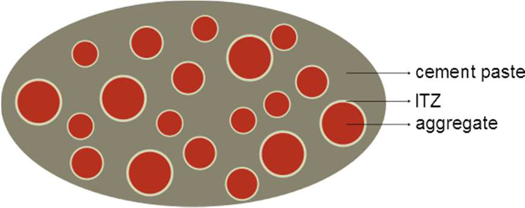

---
format:
  html:
    code-links:
      - text: Python script
        icon: file-code
        href: transport.py
---

# Transport properties {#sec-transport}

::: {.callout-important icon=false}

##  Objectives

This tutorial presents the homogenization of transport properties (diffusivity, permeability, conductivity) using *Echoes*. These are described by 2nd-order tensors and can be homogenized with the same framework as 4th-order elastic properties.

:::

::: {.callout-tip icon=false collapse=true}

##  Imports

```{python}
#| error: false
#| warning: false
#| code-fold: false
#| code-summary: Code for library imports
#| include: true

import numpy as np
from echoes import *
import math
import matplotlib.pyplot as plt

np.set_printoptions(precision=8, suppress=True)
```

:::

## Homogenization of 2nd-order tensor properties

Transport properties (diffusivity `"D"`, permeability/conductivity `"K"`) are represented by 2nd-order symmetric tensors. The `homogenize` function handles them via the `prop` argument:

```
Dhom = homogenize(prop="D", rve=myrve, scheme=sch)
```

The 2nd-order tensor properties are defined using `tensor` objects with 3x3 matrices or the identity `tId2`.

## Diffusivity of porous media

The effective diffusivity of a porous material with elongated pores can be modeled as a function of porosity and pore aspect ratio.

```{python}
#| error: false
#| warning: false
#| code-fold: false
#| include: true

Ds = 0.1 * tId2   # solid diffusivity
Dp = 1.0 * tId2   # pore diffusivity

myrve = rve(matrix="SOLID")
myrve["SOLID"] = ellipsoid(shape=spheroidal(1.), symmetrize=[ISO],
                           prop={"D": Ds})
myrve["PORE"] = ellipsoid(shape=spheroidal(0.1), symmetrize=[ISO],
                          prop={"D": Dp})

lphi = np.linspace(0., 0.6, 51)
fig, ax = plt.subplots(figsize=(8, 5))

for omega in [0.01, 0.1, 1., 10.]:
    myrve["PORE"].shape = spheroidal(omega)
    lD = []
    for phi in lphi:
        myrve["PORE"].fraction = phi
        myrve["SOLID"].fraction = 1. - phi
        try:
            D = homogenize(prop="D", rve=myrve, scheme=SC,
                           verbose=False, maxnb=300, epsrel=1.e-10)
            lD.append(max(np.trace(D.array) / 3., 0.))
        except:
            lD.append(0.)
    ax.plot(lphi, lD, label=f"ω={omega}")

ax.set_xlabel(r"$\varphi$")
ax.set_ylabel(r"$D^{hom}$")
ax.grid(True); ax.legend()
plt.show()
```

## Effect of the Interfacial Transition Zone (ITZ) {#sec-transport-itz}

In mortar, the **Interfacial Transition Zone** (ITZ) is a thin shell (~50 µm) of higher-porosity cement paste surrounding each aggregate, with a locally higher diffusivity than the bulk paste. @papadakis1991 noted that the reduction in diffusivity due to impermeable aggregates can be offset — or even reversed — by this more permeable surrounding shell.

::: {layout="[55,45]" layout-valign="center"}


The inclusion is modelled with `sphere_nlayers` (see @sec-nlayer_sphere): an impermeable aggregate (layer 0, radius $R_{agg}$) surrounded by an ITZ shell (layer 1, thickness $e_{ITZ}$), both embedded in the cement paste matrix of reference diffusivity $D_{cp} = 1$.
:::

Because the `sphere_nlayers` inclusion covers aggregate + ITZ shell, its effective volume fraction is larger than the bare aggregate fraction $f$:
$$f_{inc} = f\!\left(1 + \frac{e_{ITZ}}{R_{agg}}\right)^3$$

```{python}
#| code-fold: false

Ragg = 5.e3   # aggregate radius (µm)
eITZ = 50.    # ITZ thickness (µm)

# RVE: cement paste matrix + (aggregate + ITZ) inclusion — MT scheme
ver_itz = rve(prop={"D": tId2}, matrix="CEMENT")
ver_itz["CEMENT"] = ellipsoid(shape=spherical, prop={"D": tId2})
ver_itz["AGG"]    = sphere_nlayers(radii=[Ragg, Ragg + eITZ],
                                   prop={"D": [tZ2, tId2]})
# layer 0 = aggregate (D = 0), layer 1 = ITZ (D updated per run)

def Dhom_itz(f, d_itz):
    """Normalised effective diffusivity Dhom/Dcp (MT scheme).
    f     : bare aggregate volume fraction
    d_itz : Ditz/Dcp ratio
    """
    f2 = f * (1. + eITZ / Ragg)**3        # effective inclusion fraction
    ver_itz["CEMENT"].fraction = 1. - f2
    ver_itz["AGG"].fraction    = f2
    ver_itz["AGG"].set_prop("D", 1, d_itz * tId2)   # update ITZ diffusivity
    return np.trace(homogenize(prop="D", rve=ver_itz,
                               scheme=MT, verbose=False).array) / 3.
```

```{python}
#| code-fold: false

lf     = np.linspace(0.001, 0.999, 50)
d_list = [100., 80., 60., 50., 40., 20., 0.001]

fig, ax = plt.subplots(figsize=(7, 4.5))
for d in d_list:
    lbl = fr"$D_{{itz}}/D_{{cp}}={int(d) if d >= 1 else 0}$"
    ax.plot(lf, [Dhom_itz(f, d) for f in lf], label=lbl)

# Analytical references: purely impenetrable spheres (no ITZ)
ax.plot(lf, [(1. - f)**1.5         for f in lf], 'k--', label=r'$(1-f)^{3/2}$')
ax.plot(lf, [(1. - f)/(1. + .5*f)  for f in lf], 'k:',  label=r'$(1-f)/(1+f/2)$')

ax.set_xlabel(r"Aggregate fraction $f$")
ax.set_ylabel(r"$D^{hom}/D_{cp}$")
ax.set_xlim(0., 1.); ax.set_ylim(0., 2.)
ax.legend(fontsize=8, ncol=2); ax.grid(True)
plt.tight_layout()
plt.show()
```

The role of the aggregate+ITZ composite inclusion depends strongly on $D_{itz}/D_{cp}$:

- **$D_{itz}/D_{cp} \ll 1$**: the ITZ is also impermeable; $D^{hom}$ falls well below both bounds for simple impenetrable spheres.
- **$D_{itz}/D_{cp} \approx 50$**: the two effects nearly cancel and $D^{hom} \approx D_{cp}$ for moderate fractions — consistent with the observation of @papadakis1991.
- **$D_{itz}/D_{cp} \gg 1$**: the highly permeable ITZ network drives the effective diffusivity above the neat paste value.

### DUALDISC interface model

A thin spherical shell of radius $R$, thickness $e \ll R$ and diffusivity $D_s$ can be replaced in the limit $e \to 0$ by a **zero-thickness interface** whose sole parameter is the **transmissivity**:
$$\alpha = D_s \cdot e \qquad [\text{length}^2/\text{time} \times \text{length} = \text{length}^3/\text{time}]$$

The `DUALDISC` interface type implements this dual-discontinuity condition: the normal flux is continuous across the interface, and the concentration jump is proportional to $1/\alpha$. This avoids the explicit thin-layer and the associated volume-fraction correction $f\,(1+e_{ITZ}/R_{agg})^3$.

In this model the inclusion is simply the bare aggregate (1 layer, `radii=[Ragg]`); the ITZ is fully encoded in `interf_prop`:

```{python}
#| code-fold: false

# DUALDISC interface: transmissivity alpha = D_ITZ * e_ITZ  (Dcp = 1)
ver_dd = rve(prop={"D": tId2}, matrix="CEMENT")
ver_dd["CEMENT"] = ellipsoid(shape=spherical, prop={"D": tId2})
ver_dd["AGG"]    = sphere_nlayers(radii=[Ragg], prop={"D": [tZ2]},
                                   interf_prop={"D": [[0., DUALDISC]]})
# single interface at r=Ragg; alpha updated per run

def Dhom_dd(f, alpha):
    """Normalised effective diffusivity via DUALDISC interface (MT scheme).
    f     : aggregate volume fraction
    alpha : transmissivity = D_ITZ * e_ITZ  (Dcp = 1)
    """
    ver_dd["CEMENT"].fraction = 1. - f
    ver_dd["AGG"].fraction    = f
    ver_dd["AGG"].set_interf_prop("D", 0, [alpha, DUALDISC])
    return np.trace(homogenize(prop="D", rve=ver_dd, scheme=MT, verbose=False).array) / 3.
```

The following plots compare the two approaches for the same values of $D_{itz}/D_{cp} = \alpha/(D_{cp}\,e_{ITZ})$ — the dimensionless normalised transmissivity:

```{python}
#| code-fold: false

fig, axes = plt.subplots(1, 2, figsize=(9, 4))

# Left: DUALDISC curves
for d in d_list:
    alpha = d * eITZ
    lbl = fr"$\alpha/(D_{{cp}}\,e_{{ITZ}})={int(d) if d >= 1 else 0}$"
    axes[0].plot(lf, [Dhom_dd(f, alpha) for f in lf], label=lbl)
axes[0].plot(lf, [(1.-f)**1.5        for f in lf], 'k--', label=r'$(1-f)^{3/2}$')
axes[0].plot(lf, [(1.-f)/(1.+.5*f)  for f in lf], 'k:',  label=r'$(1-f)/(1+f/2)$')
axes[0].set_title("DUALDISC interface")
axes[0].set_xlabel(r"Aggregate fraction $f$")
axes[0].set_ylabel(r"$D^{hom}/D_{cp}$")
axes[0].set_xlim(0., 1.); axes[0].set_ylim(0., 2.)
axes[0].legend(fontsize=7, ncol=2); axes[0].grid(True)

# Right: layer model vs DUALDISC for selected values
for d, ls, lw in zip([100., 50., 20., 0.001],
                     ['-',  '--', '-.', ':'],
                     [1.5,  1.5,  1.5,  1.5]):
    lbl = fr"$D_{{itz}}/D_{{cp}}={int(d) if d >= 1 else 0}$"
    alpha = d * eITZ
    axes[1].plot(lf, [Dhom_itz(f, d)     for f in lf], color='C0', ls=ls, lw=lw, label=f'layer — {lbl}')
    axes[1].plot(lf, [Dhom_dd(f, alpha)  for f in lf], color='C1', ls=ls, lw=lw, label=f'DUALDISC — {lbl}')
axes[1].set_title(r"Layer model (blue) vs DUALDISC (orange)")
axes[1].set_xlabel(r"Aggregate fraction $f$")
axes[1].set_ylabel(r"$D^{hom}/D_{cp}$")
axes[1].set_xlim(0., 1.); axes[1].set_ylim(0., 2.)
axes[1].legend(fontsize=6.5, ncol=2); axes[1].grid(True)

plt.tight_layout()
plt.show()
```

The two models agree closely for moderate aggregate fractions: the small discrepancy at large $f$ reflects the neglected volume $f\,[(1+e_{ITZ}/R_{agg})^3-1] \approx 3f\,e_{ITZ}/R_{agg}$ of the ITZ shell (here $\approx 3\%$).

## Permeability of cracked media

The permeability of cracked media is particularly important in geomechanics. Cracks with high aperture-to-radius ratio create preferential flow paths. This coupling between elasticity and transport can be modeled by assigning both `"C"` and `"K"` properties to the RVE phases (see @sec-cracked-media).

$\,$
